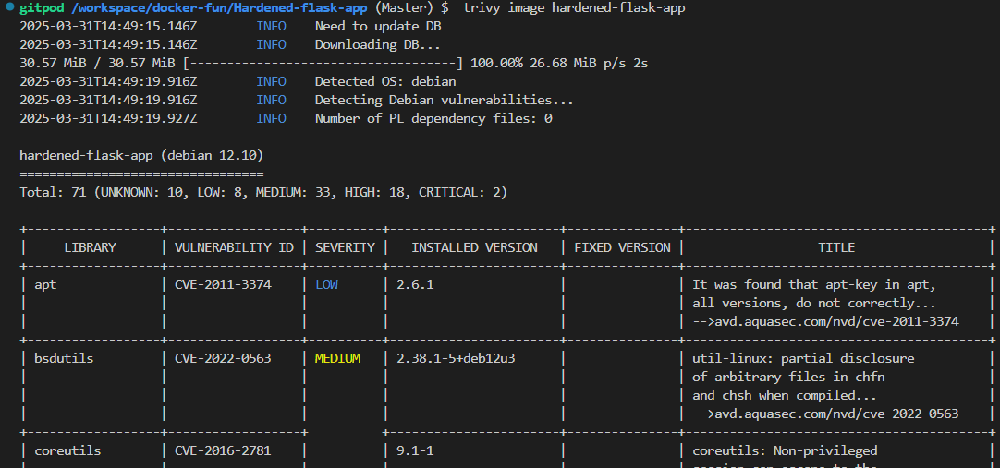

Project: Hardened Docker Container for a Flask Web App

# Prepare the Application

Create a Project Directory

```sh
mkdir hardened-flask-app
cd hardened-flask-app
```

# Create the Application Files

build app.py: A basic flask application

# write the hardened dockerfile
create a secure Dockerfile

# Build and run the docker image

```sh
docker build -t hardened-flask-app .
```
# create a docker-compose file

# deploy with docker stack
-  docker stack deploy -c docker-compose.yml hardened-app

# scan the image
```sh
trivy image hardened-flask-app
```



# Monitor the container with Falco

- view alerts logs are /var/log/falco

# Audit Security with Docker Bench for Security
Clone Docker Bench for Security

- git clone https://github.com/docker/docker-bench-security.git
cd docker-bench-security


- Run the Audit

sudo ./docker-bench-security.sh
