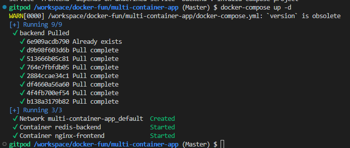
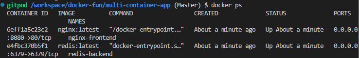
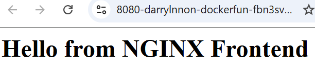
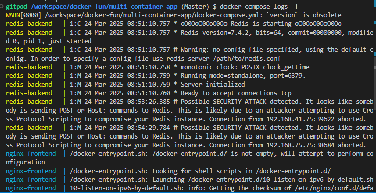
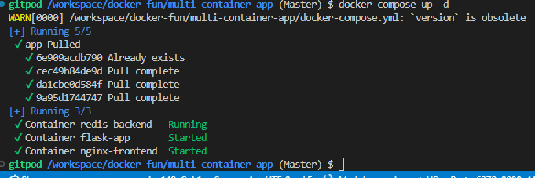
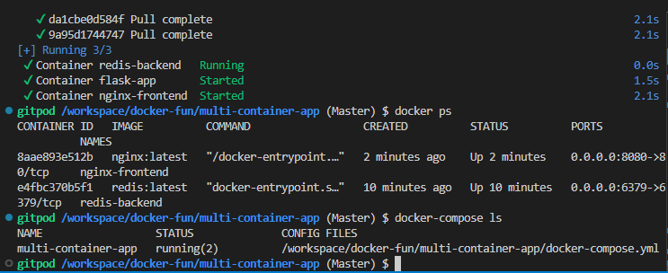

# docker-fun
hands-on practice docker

Am using gitpod, and docker is install by default on this IDE so i will just move to the next step

# verify the docker version

```sh
docker --version
sudo systemctl start docker # if it's not enable
sudo systemctl enable
```

# Run a containerized NGINX server
Am using NGINX server in this workflow

- pull the NGINX Docker image:
```sh
docker pull nginx # using the docker client pull
```

- Run the NGINX container:
```sh
docker run --name nginx-server -d -p 80:80 nginx
```


- verify the running container
```sh
docker ps
```


- Test the NGINX server:
open a browser and navigate to  http://<your-server-ip> (use localhost if on the same machine).


# Manage the NGINX Container
here i will show you how to stop, restart, and remove a container:

```sh
docker stop nginx-server # to stop the container
docker start nginx-server # to start the container
docker rm -f nginx-server # to remove the container
```

# Adavanced Customization

- Serve custom content:
Create  a directory for custom content

```sh
mkdir ~/nginx-custom
echo "<h1>Welcome to my Custom NGINX Server</h1>"> ~/nginx-custom/index.html
```
- run NGINX with the custom directory

```sh
docker run --name custom-nginx -d -p 8080:80 -v ~/nginx-custom:/usr/share/nginx/html:ro nginx
```


# Hands-on wrting a simple Dockerfile for a python app
 
 build a dockerfile

# Create and run a multi-container app
Creating and running a multi-container app involves setting up multiple services that together.For this example, i will create a simple multi-container app with NGINX as the frontend and a Redis server as the backend cache

- verify the installation of docker-compose

```sh
docker-compose --version
```
- Create the Multi-container app
I will use Docker Compose to define the app

 Create a Directory for the project
 ```sh
 mkdir multi-container-app
 cd multi-container-app
 create a docker-compose.yml File:create and edit the file
 ```

 frontend:
Uses the latest NGINX image.
Exposes port 8080.
Serves custom content.
Depends on the backend service.
backend:
Uses the latest Redis image.
Exposes port 6379 for the Redis service.

- Create a custom content for NGINX:

```sh
mkdir nginx-custom
echo "<h1>Hello from NGINX Frontend</h1>" > nginx-custom/index.html
```

- Build and run the multi-container app

```sh
docker-compose up -d # -d: run the containers in detached mode
docker ps # to verify the running containners
```




- Test the App:

Access the frontend: Open a browser and go to http://localhost:8080 to see the NGINX frontend.
Redis is running in the backend and ready for use.




# Manage the App

```sh
docker-compose down #to stop it
docker-compose up -d # to start the app
docker-compose logs -f # to view logs
```



# Include a python falsk app that connects to Redis:

📝 Explanation of Additions:
1️⃣ Added app Service:

Uses python:3.9-slim as the base image.

Mounts the local ./app directory into the container.

Runs pip install flask redis before launching the app.

2️⃣ Ensured app.py Runs Correctly:

The command installs dependencies and runs app.py automatically.





This simple example demonstrates how to design, build, and manage a multi-container app with Docker and Docker Compose
