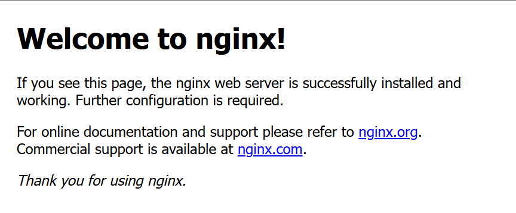
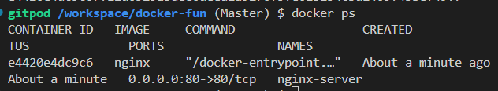
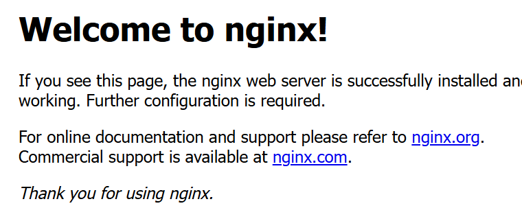
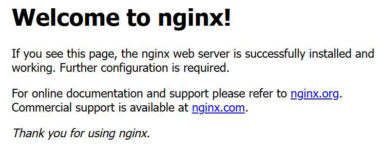
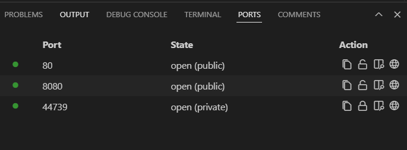

# docker-fun
hands-on practice docker

Am using gitpod, and docker is install by default on this IDE so i will just move the next step

# verify the docker version

```sh
docker --version
sudo systemctl start docker # if it's not enable
sudo systemctl enable
```

# Run a containerized NGINX server
Am using NGINX server in this workflow

- pull the NGINX Docker image:
```sh
docker pull nginx # using the docker client pull
```

- Run the NGINX container:
```sh
docker run --name nginx-server -d -p 80:80 nginx
```



- verify the running container
```sh
docker ps
```


- Test the NGINX server:
open a browser and navigate to  http://<your-server-ip> (use localhost if on the same machine).



# Manage the NGINX Container
here i will show you how to stop, restart, and remove a container:

```sh
docker stop nginx-server # to stop the container
docker start nginx-server # to start the container
docker rm -f nginx-server # to remove the container
```

# Adavanced Customization

- Serve custom content:
Create  a directory for custom content

```sh
mkdir ~/nginx-custom
echo "<h1>Welcome to my Custom NGINX Server</h1>"> ~/nginx-custom/index.html
```
- run NGINX with the custom directory

```sh
docker run --name custom-nginx -d -p 8080:80 -v ~/nginx-custom:/usr/share/nginx/html:ro nginx
```





# Hands-on wrting a simple Dockerfile for a python app.
